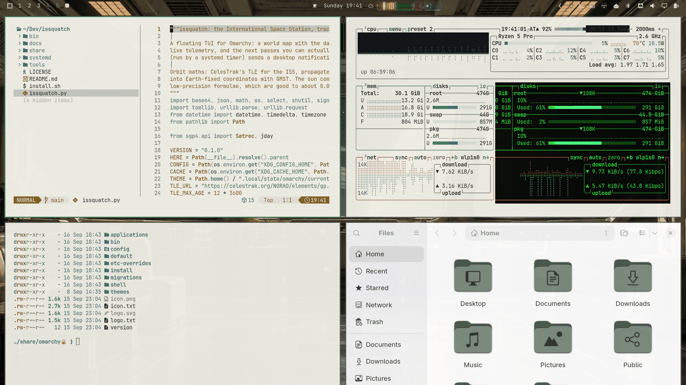
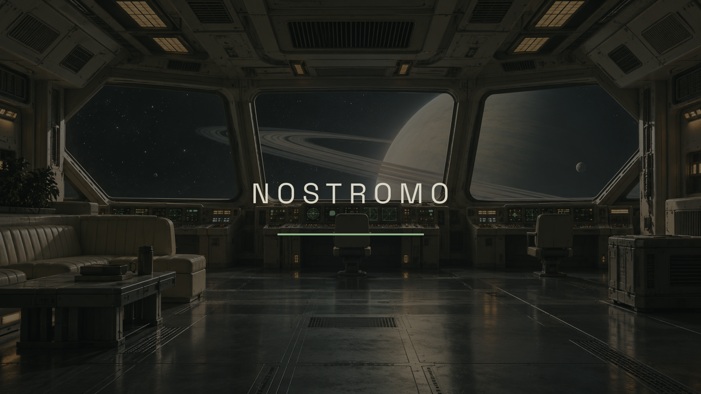

# Nostromo Light for Omarchy

> **Retired (27 September 2026).** Movie Night is dark only now: use [Nostromo](https://github.com/squatchware/omarchy-nostromo-theme). This theme still installs, but it won't be updated.

The daylight half of [Nostromo](https://github.com/squatchware/omarchy-nostromo-theme): the same artwork with a true light palette for apps and system chrome.

Part of **[Movie Night](https://squatchware.dev/movies/)** from Squatchware: six Omarchy themes for the
films we rewound until the tape wore thin, each in dark and light.




## Install

```sh
omarchy theme install https://github.com/squatchware/omarchy-nostromo-light-theme
```

Its dark twin is [Nostromo](https://github.com/squatchware/omarchy-nostromo-theme).

## What's in it

- **Colours** for everything Omarchy themes (terminals, Hyprland, the shell, btop, editors…),
  generated by Omarchy from `colors.toml`. Every text colour clears 4.5:1 on its background.
  Palette: `#EEEDE4` `#232B27` `#3F7652` `#A94740` `#3F7652` `#80620D` `#426B7A` `#79556D` `#38756E` `#9A5D12`
- **Wallpapers:**
  - `01-observation-deck.jpg`

## The rest of Movie Night

- [Clockstrike 88](https://github.com/squatchware/omarchy-clockstrike-88-theme) · [light](https://github.com/squatchware/omarchy-clockstrike-88-light-theme): Midnight asphalt, plasma orange and clock-face gold: 1980s time travel.
- [Crossed Streams](https://github.com/squatchware/omarchy-crossed-streams-theme) · [light](https://github.com/squatchware/omarchy-crossed-streams-light-theme): Ectoplasm green and proton orange: a 1980s supernatural comedy.
- [Digital Frontier](https://github.com/squatchware/omarchy-digital-frontier-theme) · [light](https://github.com/squatchware/omarchy-digital-frontier-light-theme): Void black and grid cyan: the glowing computer worlds of early-80s sci-fi.
- [Power Maze](https://github.com/squatchware/omarchy-power-maze-theme) · [light](https://github.com/squatchware/omarchy-power-maze-light-theme): Maze blue, power gold and chase red: a maze-chase arcade cabinet.
- [Tears in Rain](https://github.com/squatchware/omarchy-tears-in-rain-theme) · [light](https://github.com/squatchware/omarchy-tears-in-rain-light-theme): Rain black and neon: the wet streets of 1980s cult sci-fi noir.

## Credits

The wallpapers are original AI-generated artwork: no film frames, titles, logos or actors. This is a
fan tribute with no connection to any studio or film. The theme files are MIT (see [LICENSE](LICENSE));
the wallpaper artwork is not covered by that licence.

From [Squatchware](https://squatchware.dev) · Pixel-powered apps, tools & themes. Handmade in the woods.
